# Modeling upvotes of a post

## I'm posting this, but this its still WIP

## Here I try to build a model to predict the number of upvotes a picture what get on a website. For context, the data comes from a Russian Train image board. Data courtesy of Dmitry Zinoviev during the Spring 2018 semester Intro to Data Science class (CMPSCI-310) at Suffolk University. 

Load packages we'll need to use, define a function we'll use later


```python
import numpy as np 
import pandas as pd 
from sklearn.feature_selection import SelectPercentile
from sklearn.feature_selection import f_regression
from sklearn.ensemble import RandomForestRegressor
import matplotlib.pyplot as plt
import seaborn as sns
from sklearn.model_selection import train_test_split as tts
import pickle
from sklearn.feature_selection import VarianceThreshold
from sklearn.model_selection import KFold
from sklearn.metrics import make_scorer
from sklearn.metrics import r2_score
from sklearn.model_selection import cross_val_score
from sklearn.ensemble import ExtraTreesClassifier
from sklearn.model_selection import RandomizedSearchCV
import scipy.stats as stats


```


```python
def is_outlier(points, thresh=3.5):
    """
    Returns a boolean array with True if points are outliers and False 
    otherwise.

    Parameters:
    -----------
        points : An numobservations by numdimensions array of observations
        thresh : The modified z-score to use as a threshold. Observations with
            a modified z-score (based on the median absolute deviation) greater
            than this value will be classified as outliers.

    Returns:
    --------
        mask : A numobservations-length boolean array.

    References:
    ----------
        Boris Iglewicz and David Hoaglin (1993), "Volume 16: How to Detect and
        Handle Outliers", The ASQC Basic References in Quality Control:
        Statistical Techniques, Edward F. Mykytka, Ph.D., Editor. 
    """
    if len(points.shape) == 1:
        points = points[:,None]
    median = np.median(points, axis=0)
    diff = np.sum((points - median)**2, axis=-1)
    diff = np.sqrt(diff)
    med_abs_deviation = np.median(diff)

    modified_z_score = 0.6745 * diff / med_abs_deviation

    return modified_z_score > thresh
```

Data Dictionary as follows:

etitle - picture category  
region - region where the picture has been taken  
takenon - the date when the picture was taken, represented as YYYY-MM-DD; if the day or months are not known, 00 is usedinstead; some values in this column may be missing  
votedon - the date when the picture was posted to the site; some values in this column may be missing  
author_id - the ID of the author, represented as a positive integer number  
votes - the number of (up)votes for the picture  
viewed - the number of times the pictures was viewed  
n_comments - the number of comments to the picture  

### Read in data. Explore it at high level to prepare us for data cleansing phase


```python
##filename = r'C:\Users\mcnib\Documents\Python Scripts\pictures-train.tsv'

##df = pd.read_csv(filename, sep = '\t')

df = pd.read_csv(r'pictures-train.tsv', sep = '\t')
df.head()
```


<div>
<style scoped>
    .dataframe tbody tr th:only-of-type {
        vertical-align: middle;
    }

    .dataframe tbody tr th {
        vertical-align: top;
    }

    .dataframe thead th {
        text-align: right;
    }
</style>
<table border="1" class="dataframe">
  <thead>
    <tr style="text-align: right;">
      <th></th>
      <th>etitle</th>
      <th>region</th>
      <th>takenon</th>
      <th>votedon</th>
      <th>author_id</th>
      <th>votes</th>
      <th>viewed</th>
      <th>n_comments</th>
    </tr>
  </thead>
  <tbody>
    <tr>
      <th>0</th>
      <td>EMU</td>
      <td>RU50</td>
      <td>2002-09-00</td>
      <td>2002-10-06</td>
      <td>1</td>
      <td>32</td>
      <td>4677</td>
      <td>10</td>
    </tr>
    <tr>
      <th>1</th>
      <td>BLDG</td>
      <td>RU50</td>
      <td>2002-09-00</td>
      <td>2002-10-05</td>
      <td>1</td>
      <td>69</td>
      <td>2919</td>
      <td>0</td>
    </tr>
    <tr>
      <th>2</th>
      <td>STEAM</td>
      <td>RU36</td>
      <td>2002-08-00</td>
      <td>2002-10-05</td>
      <td>1653</td>
      <td>55</td>
      <td>3404</td>
      <td>8</td>
    </tr>
    <tr>
      <th>3</th>
      <td>DSL</td>
      <td>EE</td>
      <td>2002-08-00</td>
      <td>2002-10-05</td>
      <td>5</td>
      <td>59</td>
      <td>3014</td>
      <td>0</td>
    </tr>
    <tr>
      <th>4</th>
      <td>DSL</td>
      <td>CZ</td>
      <td>2000-00-00</td>
      <td>2002-10-05</td>
      <td>6</td>
      <td>28</td>
      <td>1955</td>
      <td>0</td>
    </tr>
  </tbody>
</table>
</div>


```python
df.shape
```


    (146646, 8)


Check for nulls


```python
df.isnull().sum()
```


    etitle        0
    region        2
    takenon       0
    votedon       5
    author_id     0
    votes         0
    viewed        0
    n_comments    0
    dtype: int64


Very small proportion of nulls, we'll simply remove the null rows. Other methods of removing nulls including replacing with mean/median for continous variables.


```python
df.dtypes
```


    etitle        object
    region        object
    takenon       object
    votedon       object
    author_id      int64
    votes          int64
    viewed         int64
    n_comments     int64
    dtype: object


```python
df.describe()
```


<div>
<style scoped>
    .dataframe tbody tr th:only-of-type {
        vertical-align: middle;
    }

    .dataframe tbody tr th {
        vertical-align: top;
    }

    .dataframe thead th {
        text-align: right;
    }
</style>
<table border="1" class="dataframe">
  <thead>
    <tr style="text-align: right;">
      <th></th>
      <th>author_id</th>
      <th>votes</th>
      <th>viewed</th>
      <th>n_comments</th>
    </tr>
  </thead>
  <tbody>
    <tr>
      <th>count</th>
      <td>146646.000000</td>
      <td>146646.000000</td>
      <td>146646.000000</td>
      <td>146646.000000</td>
    </tr>
    <tr>
      <th>mean</th>
      <td>7446.156070</td>
      <td>80.909087</td>
      <td>488.103099</td>
      <td>4.708625</td>
    </tr>
    <tr>
      <th>std</th>
      <td>6734.804194</td>
      <td>40.808702</td>
      <td>574.279116</td>
      <td>6.722282</td>
    </tr>
    <tr>
      <th>min</th>
      <td>0.000000</td>
      <td>0.000000</td>
      <td>-3592.000000</td>
      <td>-33.000000</td>
    </tr>
    <tr>
      <th>25%</th>
      <td>1661.000000</td>
      <td>52.000000</td>
      <td>162.000000</td>
      <td>0.000000</td>
    </tr>
    <tr>
      <th>50%</th>
      <td>5370.000000</td>
      <td>77.000000</td>
      <td>283.000000</td>
      <td>3.000000</td>
    </tr>
    <tr>
      <th>75%</th>
      <td>12995.000000</td>
      <td>105.000000</td>
      <td>582.000000</td>
      <td>6.000000</td>
    </tr>
    <tr>
      <th>max</th>
      <td>23900.000000</td>
      <td>383.000000</td>
      <td>16716.000000</td>
      <td>151.000000</td>
    </tr>
  </tbody>
</table>
</div>


There are negative values in the 'viewed' and 'n_comments' columns. This does not make sense intuitively and is likely a data collection problem. Let's look into how many rows in those columns contain negatives.


```python
(df['viewed'] < 0).sum()
```


    1


```python
(df['n_comments'] < 0).sum()
```


    194


Very small proportion, so we'll remove them.

'takenon' column contains many instances where month or day is unknown (00). For example, a record may look like '2018-01-01' or '2018-01-00' or '2018-00-00'. Let's explore how many often this occures. 


```python
df['takenon'].str.contains('-00').sum()/len(df)
```


    0.04990248625942746


Let's further inspect this by seeing at what proportion is the month, day, and both are the missing. First we string split the column so each year month and day are its own column. Then calculate counts.


```python
takenonMissing = df['takenon'].astype(str).str.split(pat = "-", expand = True)
takenonMissing.head()
```


<div>
<style scoped>
    .dataframe tbody tr th:only-of-type {
        vertical-align: middle;
    }

    .dataframe tbody tr th {
        vertical-align: top;
    }

    .dataframe thead th {
        text-align: right;
    }
</style>
<table border="1" class="dataframe">
  <thead>
    <tr style="text-align: right;">
      <th></th>
      <th>0</th>
      <th>1</th>
      <th>2</th>
    </tr>
  </thead>
  <tbody>
    <tr>
      <th>0</th>
      <td>2002</td>
      <td>09</td>
      <td>00</td>
    </tr>
    <tr>
      <th>1</th>
      <td>2002</td>
      <td>09</td>
      <td>00</td>
    </tr>
    <tr>
      <th>2</th>
      <td>2002</td>
      <td>08</td>
      <td>00</td>
    </tr>
    <tr>
      <th>3</th>
      <td>2002</td>
      <td>08</td>
      <td>00</td>
    </tr>
    <tr>
      <th>4</th>
      <td>2000</td>
      <td>00</td>
      <td>00</td>
    </tr>
  </tbody>
</table>
</div>


```python
takenonMissing[1].str.contains('00').sum()/len(takenonMissing) ## month
```


    0.013897412817260615


My intuition tells me month and year are likely much more important than day a picture was taken on. Lets look at distribution of months.


```python
takenonMissing[1].value_counts().plot.barh();
```


Pictures mostly taken in summer months (assuming northern hemisphere).


```python
takenonMissing[2].str.contains('00').sum()/len(takenonMissing) ## day
```


    0.04988202883133532


```python
(takenonMissing[1].str.contains('00') & takenonMissing[2].str.contains('00')).sum()/len(takenonMissing) ## both month and day
```


    0.013876955389168473


5% is a pretty significant ammount. The way I want to use 'takeon' is to extract the year and month then create a feature that tells you how old the picture was relative to when it was posted (creating a delta between the dates takenon and votedon). I think the ideal way to deal with this month missing information is to return the proportion of month occurances, then randomly impute the identical proportion for those records. This way the distribution remains about the same. But for simplification I'll just impute the month around the middle, which is '01' (January).

The variable we are trying to predict is 'votes'. We have 7 features, both quantitative and categorical. My intuition tells me 'viewed' will be the strongest predictor, having positive linear relationship with 'votes'. 'n_comments' may share this chararistic. It's hard to say without exploring if the categorical variables will be strong predictors.

### Conduct Data Cleaning and Engineer New Features

Take log of our predictor. Change respective columns to the correct data types.


```python
df['votes_log'] = np.log(df['votes'].replace(0,1))
```


```python
df['votedon'] = pd.to_datetime(df['votedon'], format='%Y-%m-%d')
```

Remove nulls and those negative values


```python
df.loc[df.votes < 0] = np.nan
df.loc[df.viewed < 0] = np.nan
df.loc[df.n_comments < 0] = np.nan

df = df.dropna(how='any')
```


```python
df['takenon'] = df['takenon'].str.replace('-00', '-01')
df['takenon'] = pd.to_datetime(df['takenon'], format='%Y-%m-%d')
```

I think the day of the week a picture gets posted effects the votes. lets extract day of week and create a weekday/weekend from votedon feature


```python
df['day_of_week'] = df['votedon'].dt.weekday_name
#df['day_of_week'] = ((pd.DatetimeIndex(df['votedon']).dayofweek) // 4 == 1).astype(float)
#df['day_of_week'] = np.where(df['day_of_week']==1, 'weekend', 'weekday')
```

Do the same for month and year


```python
df['MonthPosted'] = df['votedon'].dt.month.astype(object)
df['YearPosted'] = df['votedon'].dt.year.astype(object)
```

create 'author_range' column. author_range' is the time between an authors first and latest post. To do this. we create a new data frame which is indexed by author_id, that contains difference. We then merge it back to the orginal data frame. We also convert the data type to a pandas dt.days.


```python
ActivityRange = df.groupby('author_id')['votedon'].agg(['max','min']).reset_index()
ActivityRange['author_range'] = ActivityRange['max']-ActivityRange['min']

df = pd.merge(df,ActivityRange[['author_id','author_range']], how='inner', on='author_id')
df['author_range'] = df['author_range'].dt.days.astype(float)

```

create 'author_avg_views' and 'author_avg_comments'


```python
author_agg_dict = {'viewed': 'mean',
                   'n_comments': 'mean'}

author_avg = df.groupby('author_id').agg(author_agg_dict)

# rename columns
author_avg.columns = ['authorid_mean_views','authorid_mean_comments']
author_avg = author_avg.reset_index()

pd.merge(df,author_avg, how='inner', on='author_id').head()


```


<div>
<style scoped>
    .dataframe tbody tr th:only-of-type {
        vertical-align: middle;
    }

    .dataframe tbody tr th {
        vertical-align: top;
    }

    .dataframe thead th {
        text-align: right;
    }
</style>
<table border="1" class="dataframe">
  <thead>
    <tr style="text-align: right;">
      <th></th>
      <th>etitle</th>
      <th>region</th>
      <th>takenon</th>
      <th>votedon</th>
      <th>author_id</th>
      <th>votes</th>
      <th>viewed</th>
      <th>n_comments</th>
      <th>votes_log</th>
      <th>day_of_week</th>
      <th>MonthPosted</th>
      <th>YearPosted</th>
      <th>author_range</th>
      <th>authorid_mean_views</th>
      <th>authorid_mean_comments</th>
    </tr>
  </thead>
  <tbody>
    <tr>
      <th>0</th>
      <td>EMU</td>
      <td>RU50</td>
      <td>2002-09-01</td>
      <td>2002-10-06</td>
      <td>1.0</td>
      <td>32.0</td>
      <td>4677.0</td>
      <td>10.0</td>
      <td>3.465736</td>
      <td>Sunday</td>
      <td>10</td>
      <td>2002</td>
      <td>1736.0</td>
      <td>1476.803279</td>
      <td>1.721311</td>
    </tr>
    <tr>
      <th>1</th>
      <td>BLDG</td>
      <td>RU50</td>
      <td>2002-09-01</td>
      <td>2002-10-05</td>
      <td>1.0</td>
      <td>69.0</td>
      <td>2919.0</td>
      <td>0.0</td>
      <td>4.234107</td>
      <td>Saturday</td>
      <td>10</td>
      <td>2002</td>
      <td>1736.0</td>
      <td>1476.803279</td>
      <td>1.721311</td>
    </tr>
    <tr>
      <th>2</th>
      <td>STTNS</td>
      <td>RU50</td>
      <td>2002-11-16</td>
      <td>2002-12-28</td>
      <td>1.0</td>
      <td>5.0</td>
      <td>1465.0</td>
      <td>2.0</td>
      <td>1.609438</td>
      <td>Saturday</td>
      <td>12</td>
      <td>2002</td>
      <td>1736.0</td>
      <td>1476.803279</td>
      <td>1.721311</td>
    </tr>
    <tr>
      <th>3</th>
      <td>AUTO</td>
      <td>RU40</td>
      <td>2002-01-01</td>
      <td>2002-02-12</td>
      <td>1.0</td>
      <td>6.0</td>
      <td>3230.0</td>
      <td>2.0</td>
      <td>1.791759</td>
      <td>Tuesday</td>
      <td>2</td>
      <td>2002</td>
      <td>1736.0</td>
      <td>1476.803279</td>
      <td>1.721311</td>
    </tr>
    <tr>
      <th>4</th>
      <td>STEAM</td>
      <td>RU46</td>
      <td>2003-01-17</td>
      <td>2003-02-08</td>
      <td>1.0</td>
      <td>46.0</td>
      <td>2134.0</td>
      <td>0.0</td>
      <td>3.828641</td>
      <td>Saturday</td>
      <td>2</td>
      <td>2003</td>
      <td>1736.0</td>
      <td>1476.803279</td>
      <td>1.721311</td>
    </tr>
  </tbody>
</table>
</div>


create 'image_age' columns. 'imagee_age' is the time between votedon and takenon. change from timedelta to float


```python
df['image_age'] = abs(df['votedon']-df['takenon'])
df['image_age'] = df['image_age'].dt.days.astype(float)

```

create 'post_age'


```python
df['post_age'] = (max(df['votedon'])- df['votedon']).dt.days

```

### Exploratory Data Analysis

I like to start with univariate then move to relationship between variables.

Pie charts are not good, but my professor asked to make some. Humans just naturally aren’t very good at distinguishing differences in slices of a circle, especially not at a glance; we’re much better equipped to notice differences in rectangular shapes. I'll make bar charts as well.


```python
plt.figure(figsize=(10,10))
plt.title('etitle counts')
df['etitle'].value_counts().plot.bar();
```


```python
plt.figure(2, figsize=(10,10))
plt.title('region counts')
df['region'].value_counts().plot.bar();
```


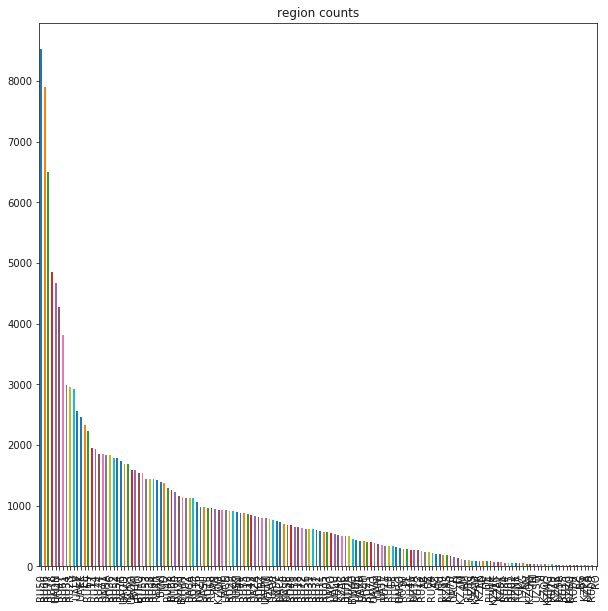


Although we can't see the names of the regions using this graph we still get an idea of their counts.


```python
plt.figure(3, figsize=(10,10))
plt.title('Upvotes Distribution')
plt.xlabel('Upvotes')
plt.hist(df['votes'], bins = 60,  label = 'Upvotes');
```


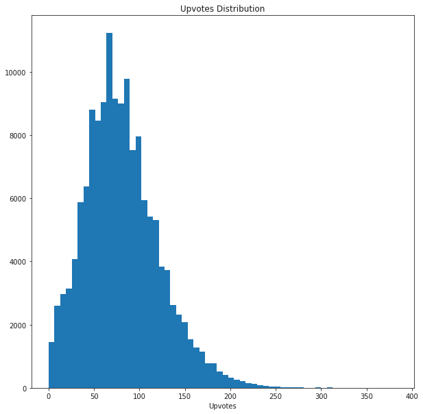


Resembles a Poisson distribution, makes sense, being that it is count data. However the mean does not approxamately equal the variance, an assumption of the poisson distribution.

Let's remove outliers from views and n_comments data to get a better look at the distribution. We'll use the MAD function defined in the beginning. MAD (median absolute deviation) is calculated by taking the absolute difference between each point and the median, and then calculating the median of those differences.  

NOTE* MAD works well for symmetrically distrubtioned data, and these are heaviyl skewed. This is a quick and dirty way of removing extreme values. Another way of identifying outliers for skewed data is adjusted boxplots.


```python
viewedRemovedOutliers = df['viewed'][~is_outlier(df['viewed'])]
len(viewedRemovedOutliers)/len(df) ## 
```


    0.8861954057523695


After removing veiws outliers we have 88% of the original data. An aggressive removal, but it will give us a a good look the distribution.


```python
commentsRemovedOutliers = df['n_comments'][~is_outlier(df['n_comments'])]
len(commentsRemovedOutliers)/len(df) ## 
```


    0.9606402447351888


```python
plt.figure(figsize=(10,10))
plt.title('Views Distribution after outlier removal')
plt.xlabel('views')
plt.hist(viewedRemovedOutliers, bins = 30);
```


```python
plt.figure(figsize=(10,10))
plt.title('n_comments after outlier removal')
plt.xlabel('n_comments')
plt.hist(commentsRemovedOutliers, bins = 15);
```


plt.figure(figsize=(10,10))
plt.title('author avg views after outlier removal')
plt.xlabel('')
plt.hist(author_avg['authorid_mean_views'][~is_outlier(author_avg['authorid_mean_views'])], bins = 30);


```python
plt.figure(figsize=(10,10))
plt.title('author avg comments after outlier removal')
plt.xlabel('')
plt.hist(author_avg['authorid_mean_comments'][~is_outlier(author_avg['authorid_mean_comments'])], bins = 15);
```


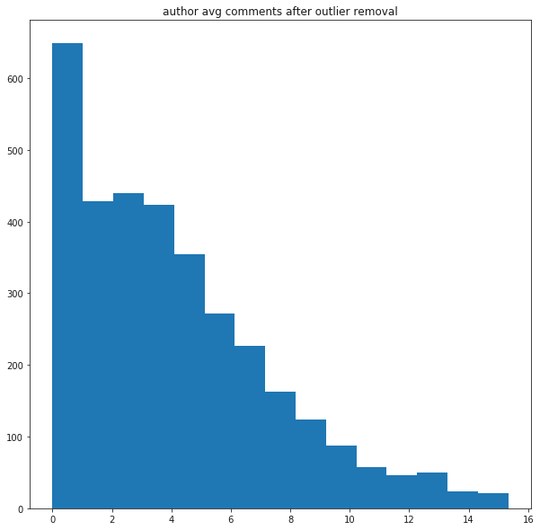


Line chart of number of AVG daily number of posts, upvotes, views, comments by year. This can tell use if theres any cyclical or seasonal component. Could hint to us if year and month is a strong predictor.  


```python
agg_dict = {'votes' : 'mean',
            'viewed': 'mean',
            'n_comments': 'mean'}

TimeSeries = df.groupby(df['votedon']).agg(agg_dict)
TimeSeries.head()
```


<div>
<style scoped>
    .dataframe tbody tr th:only-of-type {
        vertical-align: middle;
    }

    .dataframe tbody tr th {
        vertical-align: top;
    }

    .dataframe thead th {
        text-align: right;
    }
</style>
<table border="1" class="dataframe">
  <thead>
    <tr style="text-align: right;">
      <th></th>
      <th>votes</th>
      <th>viewed</th>
      <th>n_comments</th>
    </tr>
    <tr>
      <th>votedon</th>
      <th></th>
      <th></th>
      <th></th>
    </tr>
  </thead>
  <tbody>
    <tr>
      <th>2001-01-04</th>
      <td>77.0</td>
      <td>1404.00</td>
      <td>3.0</td>
    </tr>
    <tr>
      <th>2001-01-15</th>
      <td>48.0</td>
      <td>1538.00</td>
      <td>0.0</td>
    </tr>
    <tr>
      <th>2001-08-04</th>
      <td>15.0</td>
      <td>723.00</td>
      <td>0.0</td>
    </tr>
    <tr>
      <th>2001-09-24</th>
      <td>22.0</td>
      <td>1914.25</td>
      <td>0.0</td>
    </tr>
    <tr>
      <th>2001-09-26</th>
      <td>7.0</td>
      <td>1376.00</td>
      <td>4.0</td>
    </tr>
  </tbody>
</table>
</div>


```python
plt.figure(figsize=(15,10))
plt.title('AVG Daily Votes')
plt.scatter(TimeSeries.index,TimeSeries['votes'], s=0.7);
```


At 2006, we see a sharp fall then rise of avg daily votes. It seams to interrupt the increasing trend. The variability also sharply decreases for that couple month time period. (perhaps there was some type of bug?) Lets dive a little deeper


```python
TimeSeries06 = TimeSeries.loc['2004-06-01':'2007-06-01']

plt.figure(figsize=(15,10))
plt.title('AVG Daily Votes')
plt.scatter(TimeSeries06.index,TimeSeries06['votes']);
```


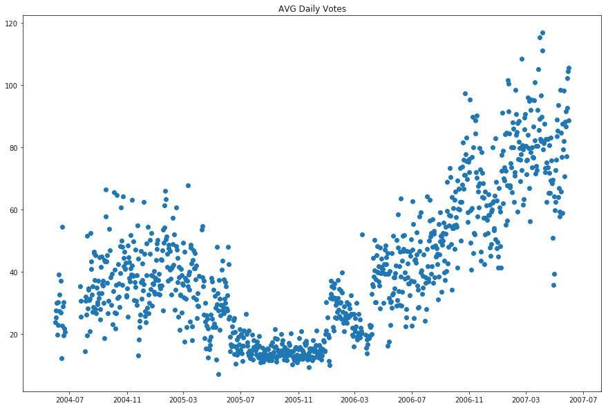


We'll calculate basic summary statistics for 2005-06-01:2006-01-01, and compare with the 6 months prior and following.


```python
TimeSeries.loc['2004-05-01':'2005-06-01'].describe()            ## Prior
```


<div>
<style scoped>
    .dataframe tbody tr th:only-of-type {
        vertical-align: middle;
    }

    .dataframe tbody tr th {
        vertical-align: top;
    }

    .dataframe thead th {
        text-align: right;
    }
</style>
<table border="1" class="dataframe">
  <thead>
    <tr style="text-align: right;">
      <th></th>
      <th>votes</th>
      <th>viewed</th>
      <th>n_comments</th>
    </tr>
  </thead>
  <tbody>
    <tr>
      <th>count</th>
      <td>340.000000</td>
      <td>340.000000</td>
      <td>340.000000</td>
    </tr>
    <tr>
      <th>mean</th>
      <td>36.162032</td>
      <td>1431.323472</td>
      <td>1.474284</td>
    </tr>
    <tr>
      <th>std</th>
      <td>10.896778</td>
      <td>354.492933</td>
      <td>1.006294</td>
    </tr>
    <tr>
      <th>min</th>
      <td>7.000000</td>
      <td>613.000000</td>
      <td>0.000000</td>
    </tr>
    <tr>
      <th>25%</th>
      <td>28.843750</td>
      <td>1222.781250</td>
      <td>0.764423</td>
    </tr>
    <tr>
      <th>50%</th>
      <td>35.713636</td>
      <td>1403.590909</td>
      <td>1.306250</td>
    </tr>
    <tr>
      <th>75%</th>
      <td>43.221429</td>
      <td>1615.459790</td>
      <td>1.912587</td>
    </tr>
    <tr>
      <th>max</th>
      <td>67.800000</td>
      <td>3329.000000</td>
      <td>6.875000</td>
    </tr>
  </tbody>
</table>
</div>


```python
TimeSeries.loc['2005-06-02':'2006-01-01'].describe()            ## During
```


<div>
<style scoped>
    .dataframe tbody tr th:only-of-type {
        vertical-align: middle;
    }

    .dataframe tbody tr th {
        vertical-align: top;
    }

    .dataframe thead th {
        text-align: right;
    }
</style>
<table border="1" class="dataframe">
  <thead>
    <tr style="text-align: right;">
      <th></th>
      <th>votes</th>
      <th>viewed</th>
      <th>n_comments</th>
    </tr>
  </thead>
  <tbody>
    <tr>
      <th>count</th>
      <td>202.000000</td>
      <td>202.000000</td>
      <td>202.000000</td>
    </tr>
    <tr>
      <th>mean</th>
      <td>15.596092</td>
      <td>1449.961491</td>
      <td>0.972742</td>
    </tr>
    <tr>
      <th>std</th>
      <td>4.628447</td>
      <td>380.549730</td>
      <td>0.536975</td>
    </tr>
    <tr>
      <th>min</th>
      <td>9.318182</td>
      <td>765.681818</td>
      <td>0.000000</td>
    </tr>
    <tr>
      <th>25%</th>
      <td>13.045455</td>
      <td>1187.246753</td>
      <td>0.621693</td>
    </tr>
    <tr>
      <th>50%</th>
      <td>14.521905</td>
      <td>1478.760766</td>
      <td>0.837719</td>
    </tr>
    <tr>
      <th>75%</th>
      <td>16.410675</td>
      <td>1675.433300</td>
      <td>1.200000</td>
    </tr>
    <tr>
      <th>max</th>
      <td>48.000000</td>
      <td>4230.153846</td>
      <td>3.125000</td>
    </tr>
  </tbody>
</table>
</div>


```python
TimeSeries.loc['2006-01-02':'2006-06-01'].describe()            ## Following
```


<div>
<style scoped>
    .dataframe tbody tr th:only-of-type {
        vertical-align: middle;
    }

    .dataframe tbody tr th {
        vertical-align: top;
    }

    .dataframe thead th {
        text-align: right;
    }
</style>
<table border="1" class="dataframe">
  <thead>
    <tr style="text-align: right;">
      <th></th>
      <th>votes</th>
      <th>viewed</th>
      <th>n_comments</th>
    </tr>
  </thead>
  <tbody>
    <tr>
      <th>count</th>
      <td>143.000000</td>
      <td>143.000000</td>
      <td>143.000000</td>
    </tr>
    <tr>
      <th>mean</th>
      <td>30.285109</td>
      <td>1194.224602</td>
      <td>5.057802</td>
    </tr>
    <tr>
      <th>std</th>
      <td>9.489487</td>
      <td>230.181611</td>
      <td>2.358198</td>
    </tr>
    <tr>
      <th>min</th>
      <td>9.961538</td>
      <td>744.545455</td>
      <td>0.400000</td>
    </tr>
    <tr>
      <th>25%</th>
      <td>22.398221</td>
      <td>996.590656</td>
      <td>3.678214</td>
    </tr>
    <tr>
      <th>50%</th>
      <td>29.863636</td>
      <td>1202.913043</td>
      <td>5.640000</td>
    </tr>
    <tr>
      <th>75%</th>
      <td>37.835714</td>
      <td>1339.543158</td>
      <td>6.796552</td>
    </tr>
    <tr>
      <th>max</th>
      <td>51.925926</td>
      <td>2092.360000</td>
      <td>8.440000</td>
    </tr>
  </tbody>
</table>
</div>


```python
plt.figure(figsize=(15,10))
plt.title('AVG Daily n_comments')
plt.scatter(TimeSeries.index,TimeSeries['n_comments'], s=0.7);
```


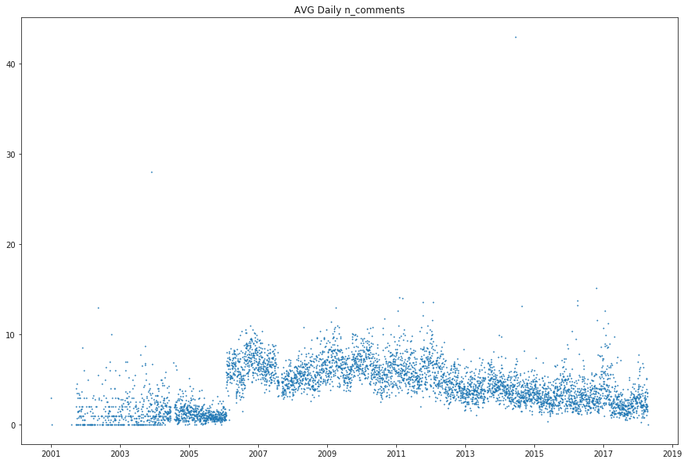


At around 2006, n_comments spike sharply. It also seams strange that the spike is at about the same period as the AVG daily votes increase.  (perhaps a website feature change? I doubt these two are independent)


```python
plt.figure(figsize=(15,10))
plt.title('AVG Daily views')
plt.scatter(TimeSeries.index,TimeSeries['viewed'], s=0.7);
```


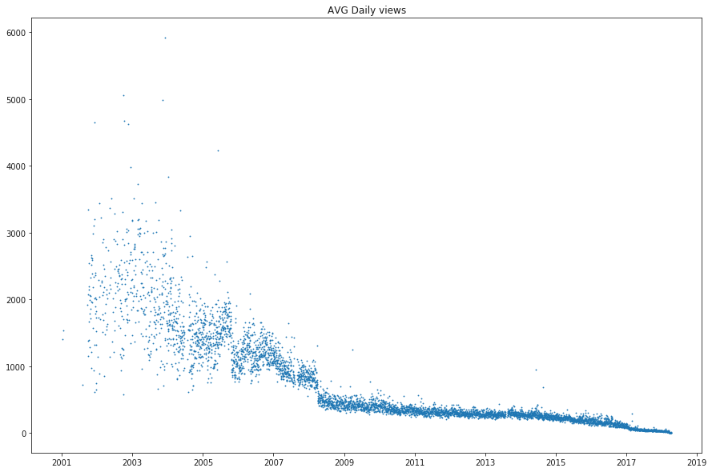


#### Basic Multivariate analysis

Lets look at average votes for each category in etitle and region. 

Below is an example of why we should be mindful of confidence intervals. Seaborn uses bootstrap sample to compute 95% CI. The TOON etitle has the highest average votes, but its CI's are also the largest because of its low sample size. I'll keep in how to create both matplotlib and seaborn bar graphs for reference. Excuse the color, I didn't like the default hue.


```python
sns.set_color_codes("pastel")

plt.figure(figsize=(10,15))
plt.title('etitle AVG votes')
## result object allows use to sort the sns.barplot
result1 = df.groupby(df.etitle)['votes'].agg('mean').sort_values(ascending = False).reset_index()
sns.barplot(x="votes",y="etitle", color = 'c',data=df, order = result1['etitle']);
```


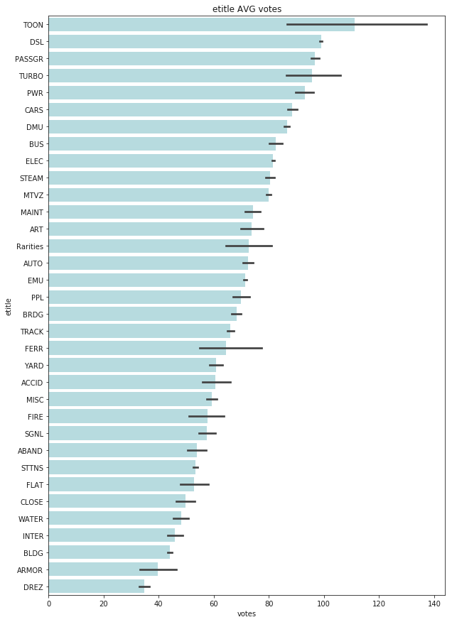


```python
plt.title('etitle AVG votes')
plt.figure(figsize=(10,10))
df.groupby(df.etitle)['votes'].agg('mean').sort_values().plot.barh();
```


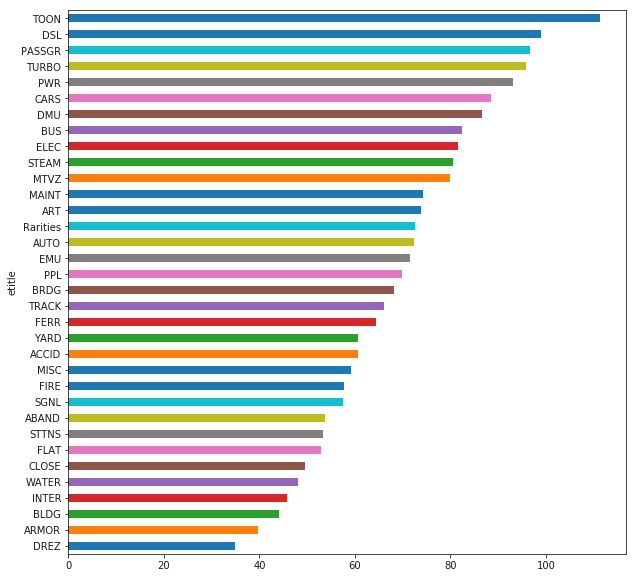


```python
sns.set_color_codes("pastel")

plt.figure(figsize=(10,30))
plt.title('Region AVG votes')
## result object allows use to sort the sns.barplot
result2 = df.groupby(df.region)['votes'].agg('mean').sort_values(ascending = False).reset_index()
sns.barplot(x="votes",y="region", color = 'b',data=df, order = result2['region']);
```


```python
plt.title('Region AVG votes')
plt.figure(5, figsize=(10,30))
df.groupby(df.region)['votes'].agg('mean').sort_values().plot.barh();
```


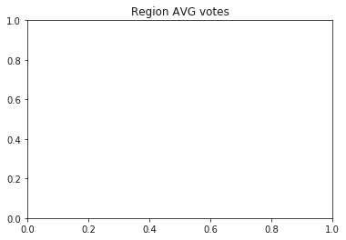


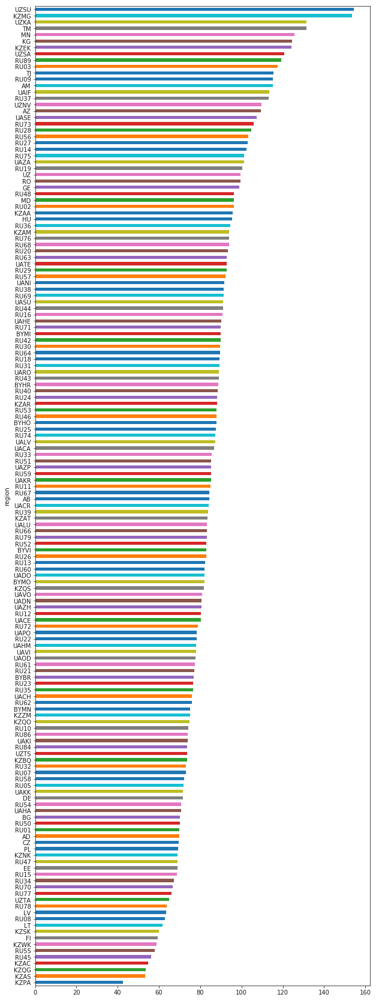


Pretty wide CI's for region average votes .


```python
df.groupby(df.day_of_week)['votes'].agg('mean').sort_values().plot.barh();
```


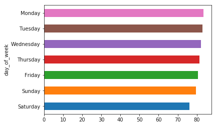


```python
df.groupby(df.day_of_week)['votes'].agg('mean').sort_values()
```


    day_of_week
    Saturday     76.041954
    Sunday       79.450942
    Friday       80.574293
    Thursday     81.472972
    Wednesday    82.221944
    Tuesday      82.912620
    Monday       83.609362
    Name: votes, dtype: float64


```python
result2 = df.groupby(df.day_of_week)['votes'].agg('mean').sort_values(ascending = False).reset_index()
sns.barplot(x="votes",y="day_of_week", color = 'r',data=df, order = result2['day_of_week']);
```


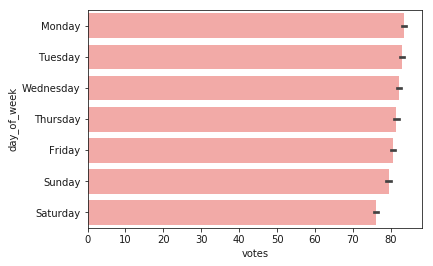


```python
df.groupby(df.day_of_week)['votes'].agg('mean').sort_values()
```


    day_of_week
    Saturday     76.041954
    Sunday       79.450942
    Friday       80.574293
    Thursday     81.472972
    Wednesday    82.221944
    Tuesday      82.912620
    Monday       83.609362
    Name: votes, dtype: float64


 It's important to note I'm using mean here as a measure of central tendency, which is not resistant to outliers. In a more applied business setting we may want to use a different metric like trimmed mean to compare groups.


```python
numerical_feats = ['viewed', 'n_comments', 'author_range',
                   'image_age', 'post_age', 'votes']
sns.pairplot(df[numerical_feats])
```


    <seaborn.axisgrid.PairGrid at 0x1d99439e400>


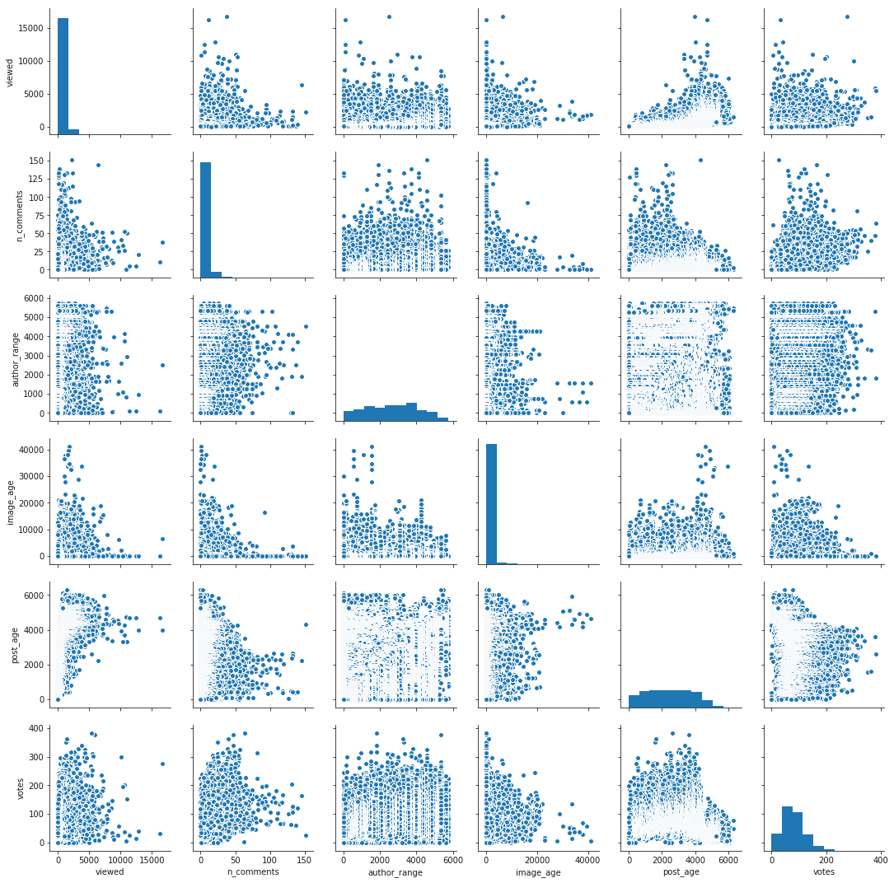


```python
# heatmap to see correlation between variables
corr = df[numerical_feats].corr()

# Generate a mask for the upper triangle
mask = np.zeros_like(corr, dtype=np.bool)
mask[np.triu_indices_from(mask)] = True

# Set up the matplotlib figure
f, ax = plt.subplots(figsize=(11, 9))

# Generate a custom diverging colormap
cmap = sns.diverging_palette(220, 10, as_cmap=True)
# Draw the heatmap with the mask and correct aspect ratio
sns.heatmap(corr, mask=mask, cmap=cmap, vmax=.3, center=0,
            square=True, linewidths=.5, cbar_kws={"shrink": .5})

```


    <matplotlib.axes._subplots.AxesSubplot at 0x1d98a6c1780>


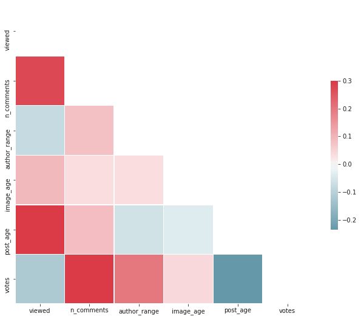


All numerical features have pretty weak linear relationships with our votes.

It's difficult to see the relationship between predictors and 'votes' because there are so many data points. We'll use a argument called kind='hex' to only display points with high frequency of occurnces.


```python
for num in list(numerical_feats) :
    sns.jointplot(num, 'votes', data = df, kind='hex',).annotate(stats.pearsonr)
    plt.show()
```


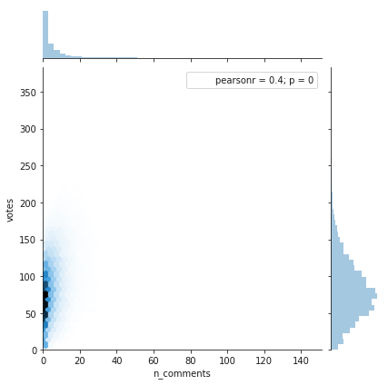


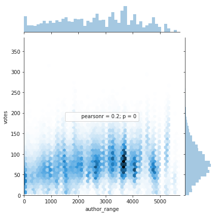


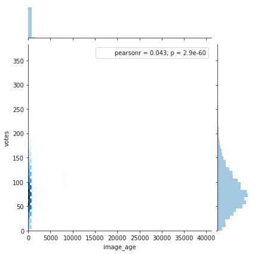


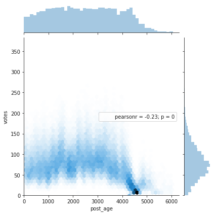


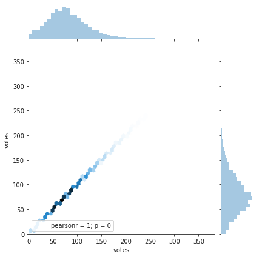


n_comments has the strongest linear relationship with votes.

From our EDA we know a few things.  

The 'votes' value is a count with approximate poisson distribution. Our quantitative features don't seam to have much of a linear relationship. n_comments has a moderate positive linear relationship with pearsonr = .4. post_age may be a problematic feature because it is essentially a numerical representation of the features 'YearPosted' and 'MonthPosted'.  

For the 'day_of_week' feature, we know that pictures that get posted on saturday get fewer average votes.

## Modeling Phase

Start with droping Columns we don't need. Convert categorical variables to dummy variables. 


```python
ml_df = df.drop(['votedon', 'takenon', 'author_id', 'votes'], axis=1)
```

When using dummy variables for a regression model, be sure to drop one factor level from the categorical feature to avoid multicolliniearity. I'm using a tree based model so I don't have to worry.


```python
ml_df = pd.get_dummies(ml_df)
```


```python
predictors = ml_df.drop('votes_log', 1)
votes_log = ml_df['votes_log']
```

Random Forest regressor, n_estimators = 10, K Fold Cross validation for model evaluation.


```python
results = {}
model = RandomForestRegressor(n_estimators = 10)
cv = KFold(n_splits=5,shuffle=True,random_state=100)
#r2 = make_scorer('neg_mean_squared_error')
r2_val_score = cross_val_score(model, predictors, votes_log, cv=cv,scoring = 'r2')
scores= [r2_val_score.mean()]
results["RandomForest"]=scores
print('Average value of Kfold cross validation, K = 5')
print(results)
```

    Average value of Kfold cross validation, K = 5
    {'RandomForest': [0.677975437111563]}
    


```python
forest = RandomForestRegressor(n_estimators = 10)

forest.fit(predictors, votes_log)
importances = forest.feature_importances_
std = np.std([tree.feature_importances_ for tree in forest.estimators_],
             axis=0)
indices = np.argsort(importances)[::-1]

# Print the feature ranking
important_features = pd.Series(data=importances,index=predictors.columns)
important_features.sort_values(ascending=False,inplace=True)


```

to do list: analyze preformance of model. intepret important features, run glm like quasi poisson or neg binomial, xg boost. maybe hyperparameter tooning. 


```python
important_features.head(25)
```


    post_age                 0.520948
    n_comments               0.106682
    viewed                   0.062704
    author_range             0.051882
    image_age                0.042495
    etitle_DSL               0.022111
    day_of_week_Friday       0.006529
    MonthPosted_5            0.005259
    etitle_ELEC              0.005241
    day_of_week_Thursday     0.004899
    day_of_week_Saturday     0.004896
    region_RU50              0.004542
    MonthPosted_1            0.004526
    etitle_BLDG              0.004455
    etitle_EMU               0.004264
    day_of_week_Sunday       0.004136
    day_of_week_Wednesday    0.004080
    day_of_week_Tuesday      0.004010
    etitle_STTNS             0.003978
    region_RU77              0.003571
    day_of_week_Monday       0.003334
    etitle_MTVZ              0.002976
    region_RU47              0.002771
    MonthPosted_7            0.002763
    region_RU78              0.002757
    dtype: float64


